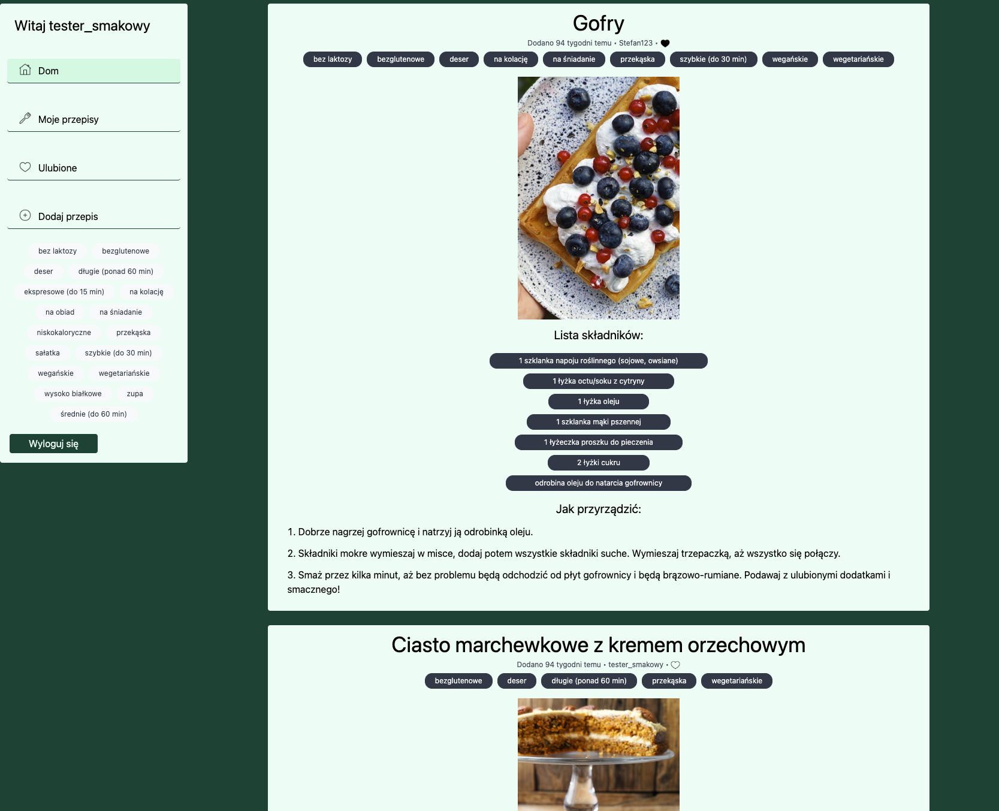

# Smakosfera

A React-based web application where you can add your recipes, view recipes added by other users, and save your favorites for quick access.

## Table of Contents

- [Smakosfera](#smakosfera)
  - [Table of Contents](#table-of-contents)
  - [Overview](#overview)
  - [Key Features](#key-features)
  - [Technologies Used](#technologies-used)
    - [Frontend Technologies](#frontend-technologies)
    - [Backend Technologies](#backend-technologies)
  - [Getting Started](#getting-started)
    - [Prerequisites](#prerequisites)
    - [Installation and Setup](#installation-and-setup)
  - [Testing Credentials](#testing-credentials)
    - [Demo Account](#demo-account)

## Overview

Smakosfera is a recipe sharing platform that allows users to discover, create, and save recipes. The application provides an intuitive interface for browsing recipes, filtering by tags, and managing a personal collection of favorites.

The project was created to make it easy for food enthusiasts to share their cooking experiences and discover new recipes from other users.

[Live Demo](https://smakosfera-a84c7.web.app/)



## Key Features

- **User Authentication**: Secure sign-up and login functionality
- **Recipe Management**: Create, view, and manage your own recipes
- **Favorite Recipes**: Save recipes from other users to your favorites collection
- **Recipe Discovery**: Browse all recipes shared by the community
- **Tag Filtering**: Filter recipes by tags to find exactly what you're looking for
- **Username Customization**: Set and change your username for personalization
- **Responsive Design**: Optimized for both desktop and mobile viewing

## Technologies Used

### Frontend Technologies

- **React**: JavaScript library for building the user interface
- **Context API**: For state management across the application
- **Tailwind CSS**: Utility-first CSS framework for styling
- **Vite**: Next Generation Frontend Tooling for fast development and building

### Backend Technologies

- **Firebase Authentication**: For user authentication and management
- **Firebase Firestore**: NoSQL database for storing recipes, user data, and tags
- **Firebase Storage**: For storing recipe images
- **Firebase Hosting**: For deploying and hosting the application

## Getting Started

### Prerequisites

- Node.js v14 or higher
- npm v6 or higher
- A Firebase account for your own deployment

### Installation and Setup

1. Clone the repository:

   ```
   git clone https://github.com/yourusername/smakosfera.git
   ```

2. Navigate to the project directory:

   ```
   cd smakosfera
   ```

3. Install dependencies:

   ```
   npm install
   ```

4. Create a Firebase project and configure Firebase services (Authentication, Firestore, Storage)

5. Create a `src/services/firebaseConfig.js` file with your Firebase configuration:

   ```javascript
   const firebaseConfig = {
     apiKey: "YOUR_API_KEY",
     authDomain: "YOUR_AUTH_DOMAIN",
     projectId: "YOUR_PROJECT_ID",
     storageBucket: "YOUR_STORAGE_BUCKET",
     messagingSenderId: "YOUR_MESSAGING_SENDER_ID",
     appId: "YOUR_APP_ID",
   };

   export default firebaseConfig;
   ```

6. Start the development server:

   ```
   npm run dev
   ```

7. To build for production:

   ```
   npm run build
   ```

8. To deploy to Firebase:
   ```
   firebase deploy
   ```

## Testing Credentials

### Demo Account

You can use the following credentials to test the application:

| Role          | Email          | Password |
| ------------- | -------------- | -------- |
| Standard User | test@gmail.com | qwerty   |
